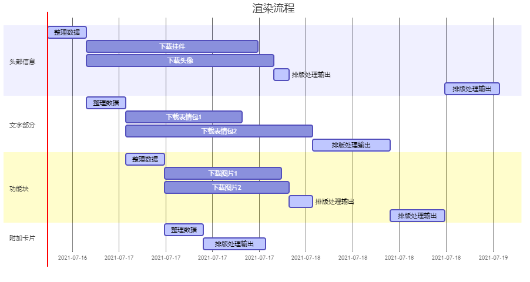
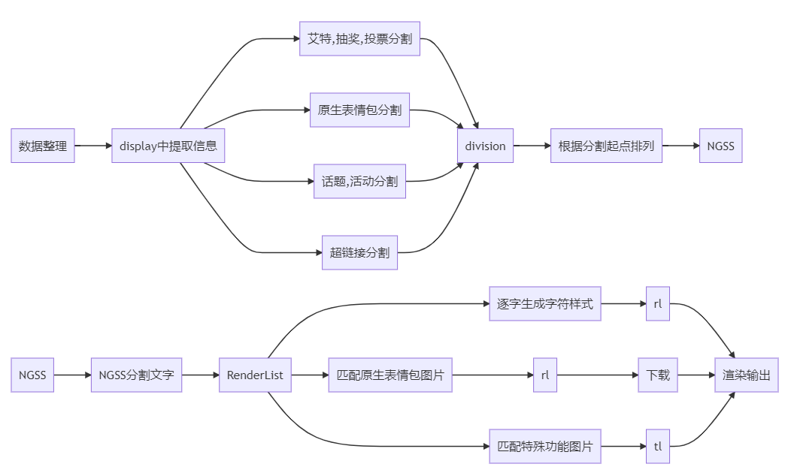

# 基于PIL的哔哩哔哩动态分享图片的渲染
<div align=center>  </div>

## 一、项目介绍
### 1、基本功能
本项目实现了将哔哩哔哩返回的数据渲染为类似与B站APP官方的分享图片。
如下图所示：
<div align=center>  </div>

### 2、环境
本项目基于**Python3.9.0**开发，**在其他版本的运行状态未知**。本项目使用2021年7月的哔哩哔哩API接口，**不保证**后续接口与数据结构不会发生变化。

### 3、依赖
|  Package  |  Version  |
|-----------|   ------  |
|aiohttp    |    3.7.2  |
|qrcode     |    6.1    |
|pydantic   |    1.7.3  |
|pathlib    |    1.0.1  |
|matplotlib |    3.4.0  |
|urllib3    |    1.25.11|
|fonttools  |    4.24.4 |

### 4、项目结构
本项目结构如下：
```
│  CODE2000.ttf            必要的字体文件 - 辅助字体（特殊符号）
│  DynamicRender.py        主要的程序文件
│  NotoColorEmoji.ttf      必要的字体文件 - emoji字体
│  readme.md               自述文件
│  Unifont.ttf             必要的字体文件 - 辅助字体（特殊符号）
│  WeiRuanYaHei-1.ttf      必要的字体文件 - 主要字体
├─element│                 图片组件
├─emoji│                   表情包缓存
├─face│                    头像缓存
├─pendant|                 头像挂件缓存
```
### 5、使用
在使用前您需要准备API返回数据中的`data`下的`card`。并且用pydantic验证，然后用这个数据实例化`DynamicRender.py`中的`DynamicPictureRendering`类，然后调用`ReneringManage`方法，即可在实例化后的`DynamicPictureRendering`类中的`ReprenderIMG`属性获得渲染后的图片。
> 提示：关于返回数据结构细节，您可以自行审阅代码或观察API返回的数据。

```python
data = {"一些数据":"..."}
# DynamicCard 这个类存在于 DynamicRender.py 文件中，您可以直接调用
data = DynamicCard(**data)
Render = DynamicPictureRendering(data)
loop = asyncio.get_event_loop()
loop.run_until_complete(Render.ReneringManage())

```
### 6、交流
外联群QQ:781665797
# 二、如何工作
我们将动态的渲染分为五大部分，每部分独立渲染：

**`头部信息`、`文字部分`、`功能块`（图片动态的图片、视频的视频等）、`附加卡片`（相关游戏、直播预约等）、`转发信息`（转发内容）**
每部分根据动态的内容渲染，如果**没有该部分则不渲染**。
每个模块渲染是**异步**的，其关系您可以根据下图理解：
<div align=center>  </div>

此图仅供参考，在使用过程中有诸多因素会影响渲染的流程。

> **附加卡片**通常不会下载图片，除了卡片展示游戏相关时。
**转发信息**就是将上述流程嵌套了一次，只是不渲染头部信息，其余基本一致，故不赘述。
## 1、头部信息
这个模块的实现是在`DynamicRender.py`中的`DynamicPictureRendering`类中的`headRendering`方法。
如项目介绍图片当中的一致，本模块实现了将头像、挂件缓存与渲染，同时本模块可以对该动态发布的时间、账号是否大会员、认证账号进行详细的渲染。

## 2、文字部分
该部分是本项目的核心模块，主要实现了将动态文字进行富文本化。实现是在`DynamicRender.py`中的`DynamicPictureRendering`类中的`NGSSTrcker`方法。
为了方便您更好对这个理解这个模块的运作方式，下图介绍了该模块的工作细节：
<div align=center>  </div>

`NGSS`识别了特殊文本的样式，和在字符串中的位置，是后续文本处理的指导性数据。
`RenderList`包含了以特殊文本为分隔符的所有文本信息。
`rl` 包含了以`字符`为单位的文本渲染信息。
`pl` 包含了以`bilibili表情包`为单位的渲染信息。
`tl` 包含了以`特殊功能图片`的渲染信息，如动态抽奖前的小礼物，投票的柱状图，网页链接的链接图标。

## 3、功能块
这个模块的实现是在`DynamicRender.py`中的`DynamicPictureRendering`类中的`FunctionBlock`方法。
它实现了渲染九宫格与专栏封面，视频封面，与直播封面。

## 4、附加卡片
这个模块的实现是在`DynamicRender.py`中的`DynamicPictureRendering`类中的`AddCard`方法。
它实现了渲染投票，视频预约，直播预约，游戏信息等。

## 5、转发信息
这个模块的实现是在`DynamicRender.py`中的`DynamicPictureRendering`类中的`Reprender`方法。
渲染源动态内容，原理与总动态基本一致，差别仅在字体颜色和对于头部信息渲染的省略。
这个模块调用了上述除过`头部信息`以外的三个模块。

# 三、贡献&license
## 1、贡献
如果您发现了更好的使用方法，不妨分享出来！你可以使用pr功能提交请求，我会审阅。或者在使用中出现了什么问题，都可以提交issue，或者加入我们的`外联群（QQ:781665797）`交流。

## 2、license
license: MIT.
